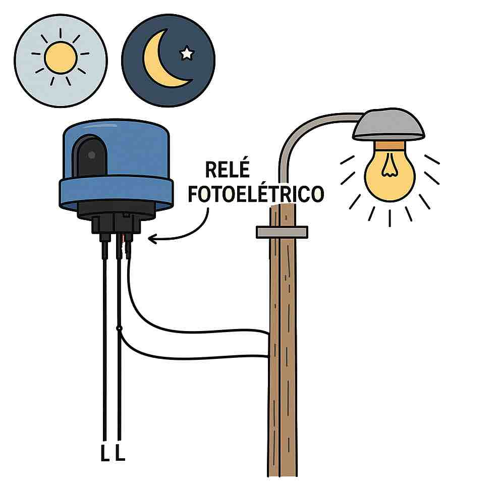
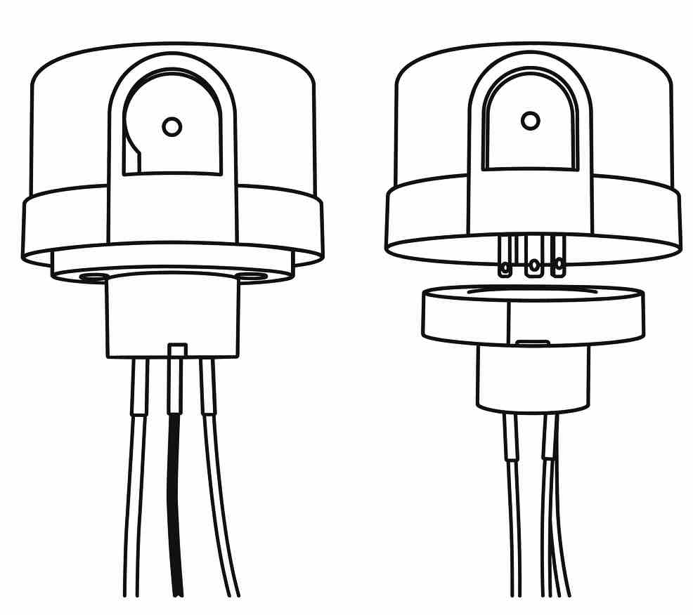

<td style="width: 10%;">
    
</td>

## **Departamento de Engenharia Elétrica - CEFET-MG**  
## **Coordenação do Curso de Eletrotécnica**  

## Disciplina: **PLIP - Prática de Laboratório de Instalações Prediais**
## Guia de Aula – Relé Fotoelétrico 
---

#  1. Objetivo da Aula
Ao final desta aula, o aluno será capaz de:

- Explicar o funcionamento de um relé fotoelétrico.  
- Identificar seus terminais e função de cada fio.  
- Distinguir tipos de relés fotoelétricos (bimetálico, eletrônico, digital).  
- Identificar aplicações práticas em iluminação pública e residencial.  
- Realizar corretamente a ligação elétrica em **127 V**, **220 V** e **220 V fase-fase**.  
- Compreender o diagrama interno básico.  
- Realizar testes, diagnósticos e manutenção.

---

#  2. O que é um Relé Fotoelétrico?
O **relé fotoelétrico** é um dispositivo que **liga e desliga automaticamente** um circuito elétrico de acordo com a **intensidade da luz** ambiente.

###  Função principal:
- Acender lâmpadas automaticamente ao anoitecer  
- Desligar ao amanhecer  

### Aplicações:
- Iluminação pública  
- Jardins  
- Fachadas  
- Galpões  
- Luzes de segurança  

---

#  3. Tipos de Relé Fotoelétrico

## a) Relé fotoelétrico bimetálico (tradicional)
- Tecnologia mais antiga.  
- Possui **lâmina bimetálica** que aquece ou esfria conforme a luz.  
- Resposta lenta (5–20 s).  
- Muito robusto, usado em iluminação pública antiga.

## b) Relé fotoelétrico eletrônico 
- Usa fototransistor ou LDR.  
- Resposta rápida (1–2 s).  
- Maior precisão.  
- Menor consumo.

## c) Relé fotoelétrico digital
- Pode ter temporização programável.  
- Alta precisão.  
- Usado em sistemas modernos e controladores automáticos.

---

#  4. Componentes Externos (Modelo comum)

- **Cúpula cinza/plástica**  
- **Janela do sensor fotoelétrico**  
- **Base de fixação**  
- **Fiação:**  
  - Vermelho → Retorno  
  - Preto → Fase  
  - Branco → Neutro  

---

#  5. Funcionamento Interno

## Modelo bimetálico 
- Possui **resistência aquecedora** e **lâmina bimetálica**.  
- Quando está escuro → resistência aquece → lâmina dobra → **liga a iluminação**.  
- Quando está claro → resistência desliga → lâmina esfria → **desliga a iluminação**.

###  Características:
- Simples  
- Robusto  
- Atraso natural (evita piscar)

---

#  6. PARTE PRÁTICA

## **Esquema 1 — 127 V (fase + neutro)**

- Preto → fase  
- Branco → neutro  
- Vermelho → retorno  
- Lâmpada recebe fase controlada + neutro direto

## **Esquema 2 — 220 V**

- Preto → fase  
- Branco → fase   
- Vermelho → retorno  
- Lâmpada recebe fase controlada + fase  

#  7. Como Testar um Relé Fotoelétrico

## Teste 1 — Manual
- Cubra a janela → lâmpada deve acender  
- Retire a mão → lâmpada apaga

## Teste 2 — Multímetro
- Medir continuidade no fio vermelho  
- Cobrir sensor → contato deve fechar

---

#  8. Defeitos Comuns

| Sintoma | Causa provável | Solução |
|--------|----------------|---------|
| Acende durante o dia | Sensor queimado | Substituir |
| Fica piscando | Lâmpada ilumina o sensor | Alterar posição |
| Não liga | Fio rompido / mau contato | Revisar conexão |
| Liga e desliga repetidamente | Lâmina superaquecendo | Trocar relé |

---

#  9. Boas Práticas de Instalação
- Instalar longe de luz direta da própria lâmpada  
- Fixar bem o suporte  
- Usar caixa de passagem  
- Evitar sombra permanente  
- Seguir **NBR 5410** para cores dos cabos  
- Proteger contra chuva e intempéries  

---

